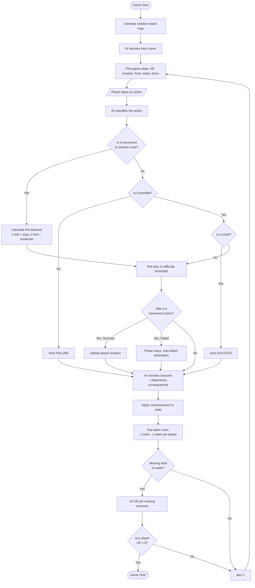
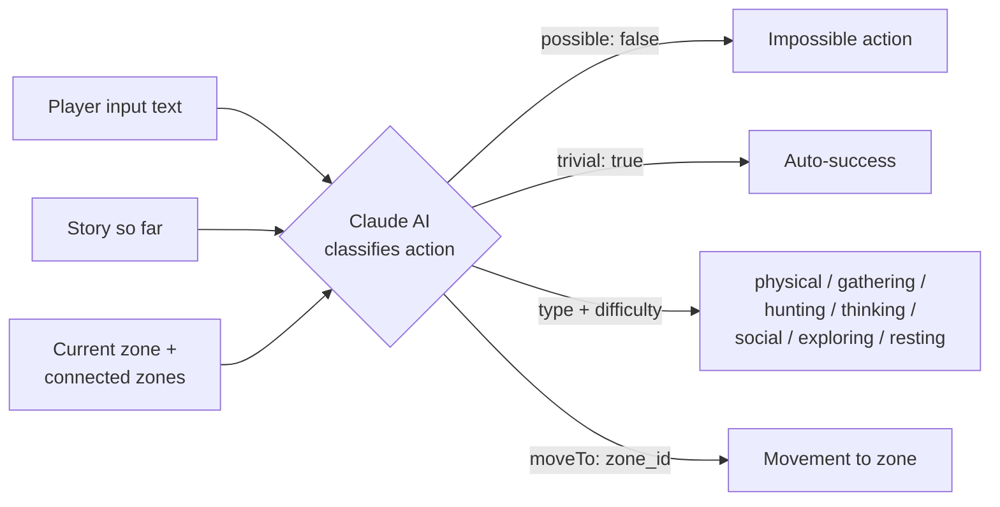
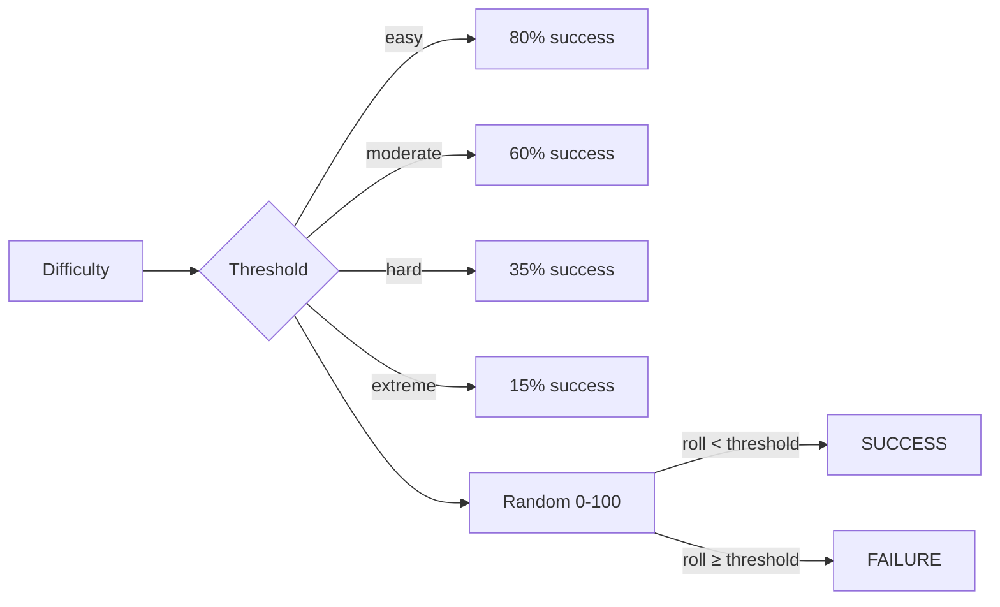
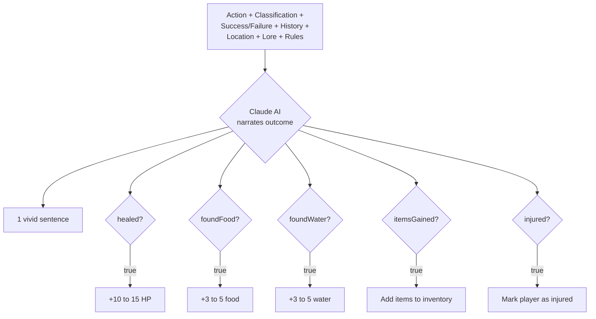
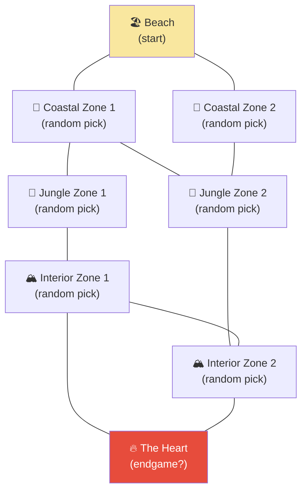

# Island Survival — Architecture & Flow

## File Overview

```
game.mjs              → Main game loop, state management, player input
action_classifier.mjs → AI classifies player input (type, difficulty, movement)
success_determiner.mjs→ Dice roll to decide success/failure
narrator.mjs          → AI narrates the outcome and determines consequences
map_generator.mjs     → Randomly builds the island map at startup
lore.txt              → Hidden island lore (fed to narrator AI)
rules.txt             → Narration style rules (fed to narrator AI)
```

## Game Loop (one turn = one day)



## Action Classification (action_classifier.mjs)



## Success Roll (success_determiner.mjs)



## Narration & Consequences (narrator.mjs)



## Island Map Structure (map_generator.mjs)



**Zone pools (2 picked randomly from each):**
- Coastal: Tidepools, Rocky Shore, Sheltered Cove
- Jungle: Dense Jungle, Jungle Clearing, River Basin, Waterfall
- Interior: Cliffs, Plateau, Cave System, Ancient Ruins, Volcanic Ridge

## Data Flow Summary

```
Player Input
    │
    ▼
┌──────────────────────┐
│  action_classifier    │ ← story history + location context
│  (Claude AI)          │
│                       │
│  Returns: type,       │
│  difficulty, moveTo,  │
│  possible, trivial    │
└──────────┬───────────┘
           │
           ▼
┌──────────────────────┐
│  success_determiner   │
│  (dice roll)          │
│                       │
│  Returns: success,    │
│  roll, threshold      │
└──────────┬───────────┘
           │
           ▼
┌──────────────────────┐
│  narrator             │ ← story history + location + lore + rules
│  (Claude AI)          │
│                       │
│  Returns: narration,  │
│  healed, foundFood,   │
│  foundWater, items,   │
│  injured              │
└──────────┬───────────┘
           │
           ▼
┌──────────────────────┐
│  game.mjs             │
│  (state update)       │
│                       │
│  Apply consequences,  │
│  deduct food/water,   │
│  check death,         │
│  advance day          │
└──────────────────────┘
```
